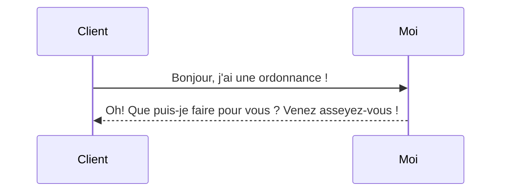

# Challenge 1 - 21.02.2022

# _Helene Nguyen
## *Présentation*


Moi c'est Hélène, et des Nguyen, je sais que tout le monde en connaît et non, je ne les connais pas tous... Mais je sais que nous sommes nombreux !

J'ai 30 ans et je vis dans la belle ville de **Colmar** !
Je suis passionnée par beaucoup de choses et si je devais citer tout ce que j'aime faire, ça fera une longue liste ! Oh mais tiens, je vais faire une liste, on est là pour s'entraîner !

Ce que j'aime faire :

 - Coder, ça tombe bien :computer:
 - Faire du sport (cardioboxe, boxe sur sac, crosstraining) :bomb:
 - Jouer du piano :notes:
 - Dessiner :pencil:
 - Coudre :kimono:
 - M'occuper de ma jungle (si, si, on dirait une jungle ici !) :cactus:
 - Tricoter :gift:
 - Cuisiner :cookie:
 - Etc. 

## *Le "contexte" =P*

En me décidant à faire cette reconversion professionnelle, je voulais accomplir ce que je recherchais : trouver un travail qui me correspond. C'est-à-dire apprendre, résoudre des énigmes ~~et apprendre et apprendre~~ !

## *Ma vie d'avant*

J'étais opticienne et cela m'a permis d'avoir l'expérience de l'autre, d'appréhender chaque cas particulier et de travailler en équipe, je me suis vue grandir mais ça reste le monde du commerce et comment dire ... Ce n'était pas ce que j'aimais le plus la vente !

C'était une boucle comme ça :


Et maintenant :

 ```mermaid
sequenceDiagram
Moi ->> Code: Trop cool !!!
Blocage-->Code: Je suis un peu larguée ...

```

# Conclusion

Ben c'est évident, ça va être trop cool cette aventure O'clock !